# Delegation Reviewer Flow Diagram

## v3.1 Architecture - With Delegation Review


## Decision Flow - delegationReviewerAgent

```mermaid
graph TD
    A[Task Description +<br/>Conversation Context] --> B[delegationReviewerAgent<br/>gpt-4o-mini]
    
    B --> C{Check ALL criteria}
    
    C -->|✅ Only 1 tool call| D1[Pass]
    C -->|❌ Multiple steps| E1[Fail]
    
    C -->|✅ Clear params| D2[Pass]
    C -->|❌ Ambiguous| E2[Fail]
    
    C -->|✅ No conditionals| D3[Pass]
    C -->|❌ If/else logic| E3[Fail]
    
    C -->|✅ No cross-refs| D4[Pass]
    C -->|❌ Multiple sources| E4[Fail]
    
    D1 & D2 & D3 & D4 -->|ALL Pass| F[delegateBack]
    E1 -->|ANY Fail| G[handlePersonally]
    E2 -->|ANY Fail| G
    E3 -->|ANY Fail| G
    E4 -->|ANY Fail| G
    
    F --> H[Return guidance:<br/>'Используй [tool] для [action]']
    G --> I[Continue to<br/>Complexity Assessment]
    
    style F fill:#90EE90
    style G fill:#FFB6C1
    style H fill:#87CEEB
```

## Examples Flow

### Example 1: Simple Task - DelegateBack

```mermaid
sequenceDiagram
    participant PA as Primary Agent
    participant IS as IntelligentSupervisor
    participant DR as delegationReviewerAgent
    
    PA->>IS: "Прочитай последнее письмо"
    IS->>DR: Review delegation
    DR->>DR: Analyze task<br/>- 1 tool call ✅<br/>- Clear params ✅<br/>- No conditionals ✅<br/>- No cross-refs ✅
    DR->>IS: decision: "delegateBack"<br/>guidance: "Используй calendar MCP"
    IS->>PA: Early return<br/>delegateBack: true<br/>guidance: "..."
    PA->>PA: Execute using MCP tool
    PA->>User: ✅ Response (fast!)
    
    Note over PA,DR: Total: ~300 tokens, 0.5-1s
```



### Example 2: Complex Task - HandlePersonally

```mermaid
sequenceDiagram
    participant PA as Primary Agent
    participant IS as IntelligentSupervisor
    participant DR as delegationReviewerAgent
    participant CA as complexityAssessorAgent
    participant EA as executorAgent
    
    PA->>IS: "Прочитай письмо от Анны<br/>и назначь встречу"
    IS->>DR: Review delegation
    DR->>DR: Analyze task<br/>- Multiple steps ❌<br/>- Dependencies ❌
    DR->>IS: decision: "handlePersonally"
    IS->>CA: Assess complexity
    CA->>IS: complexity: "medium"
    IS->>IS: Select strategy: "flat"
    IS->>EA: Execute workflow
    EA->>EA: 1. Read email<br/>2. Extract time<br/>3. Create event
    EA->>IS: Workflow complete
    IS->>PA: Full execution result
    PA->>User: ✅ Response (thorough)
    
    Note over PA,EA: Total: ~3500 tokens, 5-7s
```



## Token Comparison


## Latency Comparison

```mermaid
graph LR
    A[Task Type] --> B[Simple<br/>40-50%]
    A --> C[Medium<br/>30-40%]
    A --> D[Complex<br/>10-20%]
    
    B --> B1[v3.0: 3-4s]
    B --> B2[v3.1: 0.5-1s<br/>✅ -75%]
    
    C --> C1[v3.0: 5-7s]
    C --> C2[v3.1: 5.5-7.5s<br/>❌ +7%]
    
    D --> D1[v3.0: 10-15s]
    D --> D2[v3.1: 10.5-15.5s<br/>❌ +3%]
    
    B1 --> E[Weighted Average]
    B2 --> F[Weighted Average]
    C1 --> E
    C2 --> F
    D1 --> E
    D2 --> F
    
    E --> G[v3.0: ~6s]
    F --> H[v3.1: ~4.5s<br/>✅ -25% OVERALL]
    
    style B2 fill:#90EE90
    style H fill:#90EE90
```



## Success Metrics Dashboard


## Before/After Comparison

### v3.0 (Before)


**Always full cycle:** ~2500-5500 tokens, 3-15s

### v3.1 (After)


**Smart routing:**
- Simple: ~300 tokens, 0.5-1s (via D)
- Complex: ~2800-5800 tokens, 3-15s (via E→G→H)

---

**Legend:**
- 🟢 Green: Success/Fast path
- 🔵 Blue: New component (v3.1)
- 🟡 Yellow: Agent
- 🔴 Pink: Supervisor

