# Enhanced Complexity Assessor Flow - v3.2

## Architecture Comparison

### v3.1 (Old) - Two Sequential Agents


**Total for simple tasks:** ~600 tokens, ~1s (2 LLM calls)

### v3.2 (New) - One Unified Agent


**Total for simple tasks:** ~300 tokens, ~0.5s (1 LLM call) ✅

## Decision Flow Detail


## Examples Classification

```mermaid
graph LR
    A[Examples] --> B[tooSimple]
    A --> C[simple]
    A --> D[medium]
    A --> E[complex]
    
    B --> B1["'Прочитай письмо'<br/>'Создай 3 события'<br/>'Прочитай и создай встречу'"]
    C --> C1["'Найди свободное окно'<br/>'Проверь конфликты'"]
    D --> D1["'Если свободен, создай'<br/>'Сравни календари'"]
    E --> E1["'Найди всех и отправь'<br/>'Анализ за месяц'"]
    
    style B fill:#90EE90
    style C fill:#87CEEB
    style D fill:#FFD700
    style E fill:#FF6347
```



## Token & Latency Savings

```mermaid
graph TD
    A[Task Distribution] --> B[40-50%<br/>tooSimple]
    A --> C[20-25%<br/>simple]
    A --> D[20-25%<br/>medium]
    A --> E[5-10%<br/>complex]
    
    B --> F[v3.1: 600 tokens<br/>v3.2: 300 tokens<br/>✅ -50%]
    C --> G[v3.1: 3500 tokens<br/>v3.2: 3500 tokens<br/>→ 0%]
    D --> H[v3.1: 3800 tokens<br/>v3.2: 3500 tokens<br/>✅ -8%]
    E --> I[v3.1: 5800 tokens<br/>v3.2: 5500 tokens<br/>✅ -5%]
    
    F --> J[Weighted Average<br/>✅ -30% tokens overall]
    G --> J
    H --> J
    I --> J
    
    style B fill:#90EE90
    style F fill:#90EE90
    style J fill:#90EE90
```



## Key Innovation: Sequential ≠ Complex

```mermaid
graph TD
    A[Task: "Прочитай письмо от Анны и создай встречу"] --> B{v3.1}
    A --> C{v3.2}
    
    B --> D[2+ steps = medium]
    D --> E[delegationReviewer: handlePersonally]
    E --> F[complexityAssessor: medium]
    F --> G[Supervisor executes<br/>~3500 tokens]
    
    C --> H[No complex logic = tooSimple]
    H --> I[Early return with guidance]
    I --> J[Primary agent executes<br/>~300 tokens]
    
    style B fill:#FFB6C1
    style C fill:#90EE90
    style J fill:#90EE90
```

**Savings: 91% tokens, 85% time! 🚀**

## Implementation Flow


## Success Metrics


**Target improvements:**
- 🎯 40-50% tasks delegated back (vs 20-30% in v3.1)
- 💰 30-40% overall token savings
- ⚡ 20-30% overall latency reduction
- 📈 Better user experience with faster responses

---

**Legend:**
- 🟢 Green: Success/Optimization
- 🔵 Blue: Informational
- 🟡 Yellow: Medium complexity
- 🔴 Red: High complexity
- 🌸 Pink: Old/Removed components
