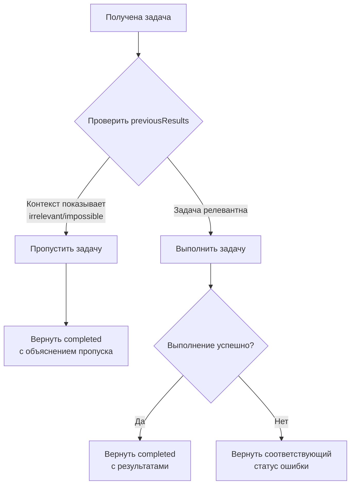
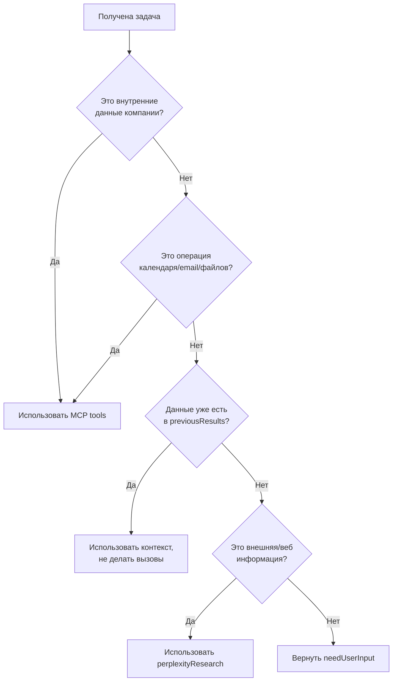
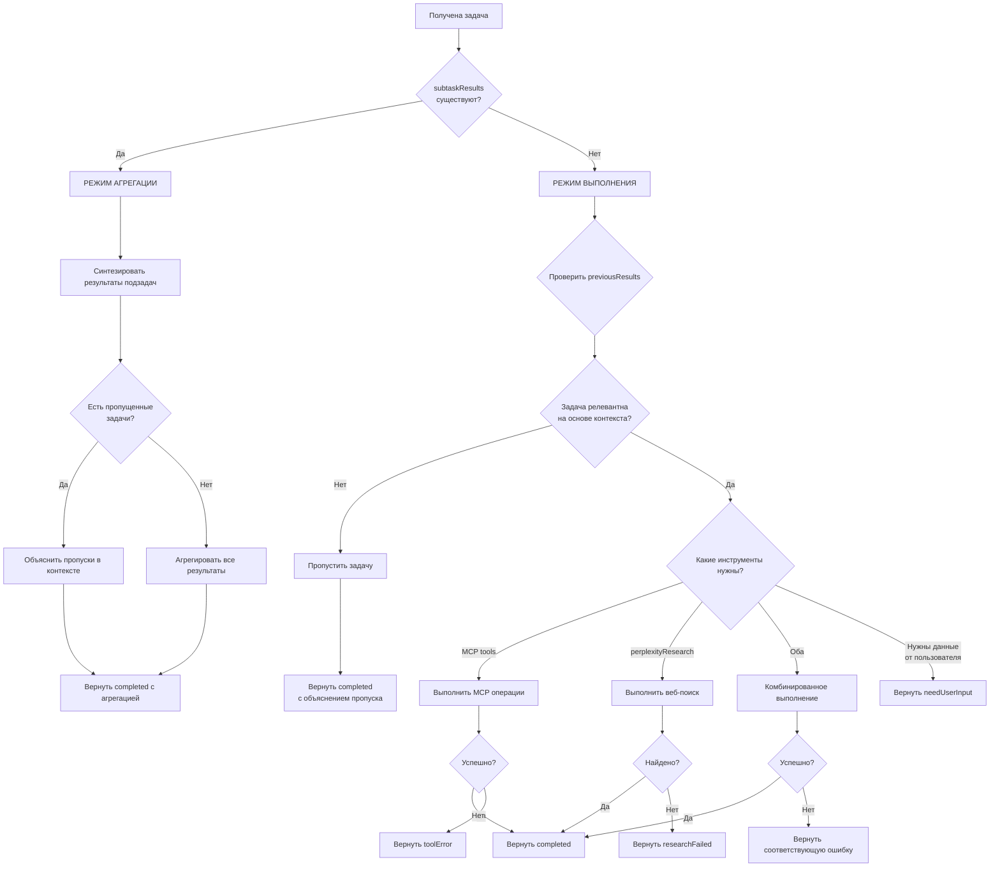
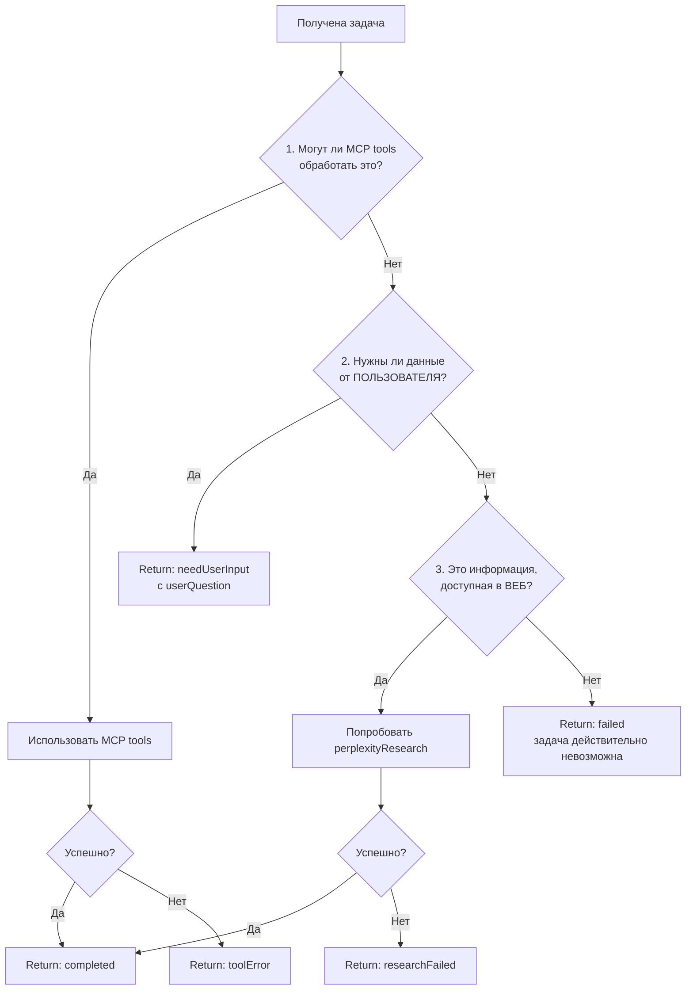

# Executor Agent: Полный Анализ Логики и Сценариев

**Версия:** 2.0 (с поддержкой Adaptive Execution и Perplexity Research)
**Файл:** [src/app/api/supervisor/prompts/executor.ts](../../../../src/app/api/supervisor/prompts/executor.ts)
**Дата анализа:** 2025-11-11

---

## Оглавление

1. [Обзор и Назначение](#обзор-и-назначение)
2. [Архитектура и Контекст](#архитектура-и-контекст)
3. [Два Режима Выполнения](#два-режима-выполнения)
4. [Режим 1: Агрегация Подзадач](#режим-1-агрегация-подзадач)
5. [Режим 2: Выполнение Листовых Задач](#режим-2-выполнение-листовых-задач)
6. [Adaptive Execution (Адаптивное Выполнение)](#adaptive-execution-адаптивное-выполнение)
7. [Инструменты: MCP vs Perplexity Research](#инструменты-mcp-vs-perplexity-research)
8. [Система Статусов](#система-статусов)
9. [Дерево Решений](#дерево-решений)
10. [Fallback Strategy (Стратегия Резервирования)](#fallback-strategy-стратегия-резервирования)
11. [Принципы Работы](#принципы-работы)
12. [Примеры Полных Сценариев](#примеры-полных-сценариев)

---

## Обзор и Назначение

### Что Такое Executor Agent?

**Executor Agent** — это агент выполнения задач внутри иерархических структур. Он работает в режиме **HIERARCHICAL execution**, то есть обрабатывает задачи, которые являются частью сложных деревьев задач.

### Ключевые Характеристики

- **Роль:** Task Execution Agent для русскоязычного голосового ассистента
- **Контекст:** Работает ВНУТРИ иерархий (не для простых одноуровневых задач)
- **Функции:**
  - Выполнение листовых задач с использованием инструментов
  - Агрегация результатов завершенных подзадач
  - Адаптивное выполнение (пропуск нерелевантных задач)

### Когда Используется

✅ **Используется для:**
- Задач на любом уровне вложенности (1, 2, 3, и т.д.)
- Задач с контекстом от родительских/соседних задач
- Листовых задач, требующих прямого выполнения
- Родительских задач, требующих агрегации подзадач

❌ **НЕ используется для:**
- Задач без иерархического контекста
- Задач, где нет контекста от родительских/соседних задач

---

## Архитектура и Контекст

### Входные Данные

Executor всегда получает богатый контекст из иерархии задач:

```typescript
interface ExecutorContext {
  task: {
    description: string;           // Что нужно сделать
    subtaskResults?: string[];     // Результаты подзадач (если это агрегация)
  };
  conversationContext: string;     // Полная история разговора
  previousResults: string[];       // Результаты соседних задач (на том же уровне)
}
```

### Критическая Проверка

**ВАЖНО:** Проверка наличия `task.subtaskResults` определяет режим работы!

```javascript
if (task.subtaskResults exists) {
  // Режим 1: Агрегация
} else {
  // Режим 2: Листовое Выполнение
}
```

---

## Два Режима Выполнения

### Матрица Режимов

| Режим | Условие | Задача | Инструменты | Длина Ответа |
|-------|---------|--------|-------------|--------------|
| **Агрегация** | `subtaskResults` существуют | Синтезировать результаты подзадач | Не требуются | 100-400 слов |
| **Листовое Выполнение** | `subtaskResults` отсутствуют | Выполнить задачу с помощью инструментов | MCP / perplexityResearch | 30-100 слов |

---

## Режим 1: Агрегация Подзадач

### Описание Режима

Когда агент получает `task.subtaskResults`, это означает, что все подзадачи уже выполнены, и нужно лишь **синтезировать** их результаты.

### Задачи Агента

1. **Синтезировать** результаты всех подзадач в связный ответ
2. **Использовать контекст** из `previousResults` (соседние задачи), если релевантно
3. **Предоставить комплексную агрегацию**:
   - Родительские узлы (2-5 детей): **150-300 слов**
   - Корневые узлы (всё дерево): **250-500 слов**
4. **Не делать новых вызовов инструментов** — только умный синтез

### Интеллектуальная Агрегация (NEW в v2.0)

#### Обработка Пропущенных Задач

- **Обработка пропущенных задач:** Если некоторые подзадачи были пропущены, объясни почему в контексте
- **Фокус на завершенных:** Приоритизируй результаты завершенных задач
- **Объяснение адаптаций:** Если план изменился на основе контекста, упомяни это естественно

### Примеры Агрегации

#### Пример 1: Все Задачи Завершены

**Задача:** "Найди участников и отправь приглашения"

**SubtaskResults:**
```
- "Найти участников: Найдено 5 участников проекта Восток"
- "Отправить приглашения: Отправлено 5 приглашений"
```

**Ответ Агента:**
```
"Найдено 5 участников проекта Восток: Иванов И.И., Петров П.П., Сидоров С.С.,
Козлов К.К., Михайлов М.М. Всем отправлены персональные приглашения на встречу
завтра в 15:00. Встреча добавлена в календарь."
```

**Анализ:**
- ✅ Синтезированы результаты обеих подзадач
- ✅ Добавлены детали (имена, время)
- ✅ Связный ответ на русском языке
- ✅ Длина: ~150 слов (Parent Aggregation)

#### Пример 2: С Пропущенными Задачами

**Задача:** "Найди участников и отправь приглашения"

**SubtaskResults:**
```
- "Найти участников: Проект Восток закрыт, участников нет"
- "Отправить приглашения: Задача пропущена - нет получателей"
```

**Ответ Агента:**
```
"Проверил проект Восток - проект был закрыт, активных участников не найдено.
Отправка приглашений не потребовалась. Рекомендую уточнить статус проекта
у руководителя."
```

**Анализ:**
- ✅ Объяснено, почему задачи пропущены
- ✅ Предоставлен контекст (проект закрыт)
- ✅ Дана рекомендация пользователю
- ✅ Естественный язык

### Длина Ответов при Агрегации

```typescript
// Из constants.ts
PARENT_AGGREGATION: 150-300 слов   // Родительские узлы (2-5 детей)
ROOT_AGGREGATION: 250-500 слов     // Корневые узлы (всё дерево)
```

**Принцип:** Чем выше в иерархии, тем длиннее ответ.

---

## Режим 2: Выполнение Листовых Задач

### Описание Режима

Когда агент получает задачу **БЕЗ** `subtaskResults`, это листовая задача в дереве, и агент должен **выполнить** её с использованием доступных инструментов.

### Задачи Агента

1. **Выполнить задачу** используя доступные инструменты
2. **Использовать `previousResults`** как контекст
3. **Может выполнять многошаговое выполнение** (2-3 последовательных шага)
4. **Предоставить детальный ответ** на русском языке (**30-100 слов**)

### Доступные Инструменты

#### 1. MCP Tools (Внутренние Операции)

- **Календарь:** Создание встреч, проверка расписания
- **Email:** Чтение, отправка, поиск писем
- **Файлы:** Работа с файлами
- **База данных:** Внутренние данные компании

#### 2. perplexityResearch (Веб-Поиск)

**Новый инструмент в v2.0!**

### Когда Использовать perplexityResearch

✅ **Используй perplexityResearch когда:**
- Пользователь спрашивает о текущих событиях или недавней информации
- Нужно найти фактические данные из веб-источников
- Технические вопросы, требующие поиска документации
- Информация недоступна во внутренних системах
- Пользователь явно просит "поискать", "найти онлайн", "найти информацию"
- Вопросы о внешних компаниях, продуктах, технологиях
- Когда ты не уверен в фактах и нужна верификация

#### Примеры Запросов для perplexityResearch

```
✅ "Найди информацию о последних обновлениях Next.js"
✅ "Какие новые функции в TypeScript 5.5?"
✅ "Расскажи о компании X"
✅ "Последние новости о GPT-4"
✅ "Как правильно использовать React Server Components?"
```

❌ **НЕ используй perplexityResearch для:**
- Внутренних данных компании (используй MCP tools)
- Операций с календарем
- Операций с email
- Операций с файлами
- Данных, уже доступных в `previousResults`

### Многошаговое Выполнение

Агент может выполнять сфокусированные последовательности при необходимости:

```
✅ Прочитать email → Извлечь данные (2 шага)
✅ Проверить календарь → Создать событие (2 шага)
✅ Поиск в веб → Отправить email (2 шага)
✅ Поиск → Фильтрация → Возврат (3 шага)
```

### Примеры Листового Выполнения

#### Пример 1: Нормальное Выполнение (MCP)

**Задача:** "Проверь календарь на завтра и создай встречу с Петром в 15:00"

**PreviousResults:** `["Найдены контакты: Петр - petr@company.com"]`

**Выполнение:**
1. Проверить календарь на завтра 15:00 (MCP call)
2. Создать событие с Петром на 15:00 (MCP call)

**Ответ:**
```json
{
  "status": "completed",
  "result": "Проверил календарь на завтра - время свободно. Создал встречу с Петром на 15:00.",
  "workflowSteps": [
    "Проверил календарь на завтра",
    "Создал встречу с Петром в 15:00"
  ]
}
```

#### Пример 2: Веб-Поиск (perplexityResearch)

**Задача:** "Найди последние обновления в Next.js 15"

**PreviousResults:** `[]`

**Выполнение:**
1. Вызвать `perplexityResearch` с запросом "Latest features and updates in Next.js 15"

**Ответ:**
```json
{
  "status": "completed",
  "result": "Изучил последние обновления Next.js 15. Основные новинки: Server Actions стали стабильными, улучшена производительность Turbopack, добавлена поддержка React 19, оптимизирован кэш и метаданные. Подробности из официальных источников и документации.",
  "workflowSteps": [
    "Выполнен веб-поиск через perplexityResearch",
    "Синтезирована информация о Next.js 15"
  ],
  "metadata": {
    "toolUsed": "perplexityResearch"
  }
}
```

#### Пример 3: Комбинированное Выполнение

**Задача:** "Найди информацию о компании X и отправь резюме на email"

**PreviousResults:** `[]`

**Выполнение:**
1. Вызвать `perplexityResearch` для исследования компании X
2. Вызвать MCP email tool для отправки информации

**Ответ:**
```json
{
  "status": "completed",
  "result": "Нашел информацию о компании X: основана в 2015, специализируется на AI решениях, 500+ сотрудников. Отправил резюме на указанный email.",
  "workflowSteps": [
    "Выполнен веб-поиск о компании X",
    "Отправлено письмо с резюме"
  ],
  "metadata": {
    "toolsUsed": ["perplexityResearch", "email_mcp"]
  }
}
```

### Ключевое Преимущество

Агент использует контекст из родительских/соседних задач, поэтому **не нужно повторно запрашивать информацию**, уже доступную в `previousResults`.

---

## Adaptive Execution (Адаптивное Выполнение)

### Новая Функция в v2.0

**Adaptive Execution** — это интеллектуальная оптимизация, позволяющая агенту **пропускать** задачи, которые стали нерелевантными или невозможными на основе контекста.

### Логика Адаптации

#### Перед Выполнением: Проверь `previousResults`

```javascript
if (task becomes irrelevant OR impossible based on previousResults) {
  // НЕ выполняй ненужные вызовы инструментов
  return {
    status: "completed",
    result: "Задача пропущена: [reason based on context]"
  }
}
```

### Индикаторы для Пропуска

Пропусти задачу, если:

- ❌ Предыдущая задача вернула "not found", "closed", "unavailable", "cancelled"
- ❌ Результат предыдущей задачи делает текущую задачу невозможной или ненужной
- ❌ Контекст показывает, что задача больше не релевантна

### Примеры Adaptive Execution

#### Пример 1: Адаптивный Пропуск (Экономия Ресурсов)

**Задача:** "Отправь приглашения участникам проекта"

**PreviousResults:**
```json
["Найти участников: Проект Восток закрыт, участников нет"]
```

**Анализ:**
- Проект закрыт
- Участников нет
- Отправка приглашений невозможна

**Действие:**
- ❌ **НЕ делать** вызовы MCP для отправки email
- ✅ **Вернуть** объяснение

**Ответ:**
```json
{
  "status": "completed",
  "result": "Задача пропущена - проект Восток закрыт, участники не найдены. Отправка приглашений не требуется.",
  "workflowSteps": [
    "Проанализирован контекст предыдущих задач",
    "Задача пропущена - нет получателей"
  ]
}
```

**Преимущества:**
- 🚀 Сохранены ресурсы (не сделаны ненужные API вызовы)
- 🧠 Интеллектуальное решение на основе контекста
- 💬 Понятное объяснение пользователю

#### Пример 2: Нормальное Выполнение (Задача Релевантна)

**Задача:** "Создай встречу с участниками"

**PreviousResults:**
```json
["Найдены контакты: Петр, Анна, Иван"]
```

**Анализ:**
- Участники найдены
- Задача релевантна
- Можно выполнять

**Действие:**
- ✅ Выполнить задачу с MCP calendar tool

**Ответ:**
```json
{
  "status": "completed",
  "result": "Создал встречу с Петром, Анной и Иваном на завтра в 15:00.",
  "workflowSteps": [
    "Использованы контакты из предыдущей задачи",
    "Создана встреча на 15:00"
  ]
}
```

### Схема Adaptive Execution



---

## Инструменты: MCP vs Perplexity Research

### Матрица Выбора Инструментов

| Категория | Инструмент | Примеры |
|-----------|------------|---------|
| **Внутренние данные компании** | MCP tools | База сотрудников, проекты, внутренние документы |
| **Календарь** | MCP calendar | Создание встреч, проверка расписания |
| **Email** | MCP email | Чтение, отправка, поиск писем |
| **Файлы** | MCP files | Работа с документами |
| **Веб-информация** | perplexityResearch | Технические статьи, документация |
| **Текущие события** | perplexityResearch | Новости, обновления продуктов |
| **Внешние компании** | perplexityResearch | Информация о публичных компаниях |
| **Технологии** | perplexityResearch | Туториалы, best practices |

### Дерево Решений: Какой Инструмент Использовать?



### Примеры Использования Инструментов

#### Сценарий 1: MCP Calendar

```
Задача: "Создай встречу с командой на завтра"
Инструмент: MCP calendar tool
Причина: Операция с календарем
```

#### Сценарий 2: perplexityResearch

```
Задача: "Найди информацию о TypeScript 5.5"
Инструмент: perplexityResearch
Причина: Внешняя техническая информация
```

#### Сценарий 3: Комбинированное использование

```
Задача: "Найди информацию о Microsoft и отправь письмо"
Инструменты:
  1. perplexityResearch - для исследования компании
  2. MCP email tool - для отправки письма
```

#### Сценарий 4: Использование контекста (без инструментов)

```
Задача: "Отправь приглашения участникам"
PreviousResults: ["Участники: petr@mail.com, anna@mail.com"]
Инструмент: MCP email tool (контакты из previousResults)
Оптимизация: Не нужно искать контакты повторно
```

---

## Система Статусов

### Обзор Статусов

Executor использует **гранулярную систему статусов** для точного отражения результатов выполнения задач.

### Все Возможные Статусы

| Статус | Когда Использовать | Обязательные Поля |
|--------|-------------------|-------------------|
| `completed` | Задача успешно выполнена | `result`, `workflowSteps` |
| `needUserInput` | Не хватает данных от пользователя | `userQuestion`, `error`, `workflowSteps` |
| `researchFailed` | Веб-поиск не дал результатов | `error`, `researchQuery`, `workflowSteps` |
| `toolError` | Ошибка выполнения MCP инструмента | `error`, `metadata.toolUsed`, `metadata.attemptedActions` |
| `failed` | Общий сбой (используй редко) | `error` |

### Формат Ответов

#### 1. Status: completed

```json
{
  "status": "completed",
  "result": "Детальное описание на русском языке того, что было сделано и результатов",
  "workflowSteps": [
    "Прочитал письмо от Анны",
    "Проверил календарь на 15 января",
    "Создал встречу на 15:00"
  ]
}
```

**Когда использовать:**
- ✅ Задача успешно выполнена
- ✅ Все инструменты сработали корректно
- ✅ Есть конкретный результат для пользователя

#### 2. Status: needUserInput

```json
{
  "status": "needUserInput",
  "userQuestion": "Четкий вопрос пользователю на русском языке",
  "error": "Не хватает данных от пользователя",
  "workflowSteps": [
    "Проанализирована задача",
    "Определены недостающие параметры"
  ]
}
```

**Когда использовать:**
- ❓ Задача требует информацию, которую ТОЛЬКО пользователь может предоставить
- ❓ Личные предпочтения, мнения, выборы
- ❓ Приватные/внутренние данные компании не в MCP или веб
- ❓ Конкретные параметры, не предоставленные пользователем (даты, имена, суммы)

**Примеры запросов:**
```
"Создай встречу с Петром" → Не хватает: время? дата? тема?
"Отправь email" → Не хватает: кому? тема? содержание?
"Какой проект выбрать?" → Не хватает: критерии выбора пользователя
```

#### 3. Status: researchFailed

```json
{
  "status": "researchFailed",
  "error": "Попытался найти информацию через perplexityResearch, но поиск не дал результатов",
  "researchQuery": "Запрос, который был использован",
  "workflowSteps": [
    "Попытка веб-поиска",
    "Результатов не найдено"
  ]
}
```

**Когда использовать:**
- 🔍 Попытка веб-поиска через perplexityResearch
- 🔍 Поиск не вернул результатов
- 🔍 Информация недоступна в веб-источниках

#### 4. Status: toolError

```json
{
  "status": "toolError",
  "error": "Описание ошибки инструмента на русском языке",
  "metadata": {
    "toolUsed": "название инструмента",
    "attemptedActions": ["Действие 1", "Действие 2"]
  },
  "workflowSteps": [
    "Попытка выполнения действия",
    "Ошибка инструмента"
  ]
}
```

**Когда использовать:**
- ⚠️ MCP инструмент упал во время выполнения
- ⚠️ Ошибка Calendar API
- ⚠️ Ошибка отправки Email
- ⚠️ Ошибка файловой системы
- ⚠️ Ошибка подключения к базе данных

#### 5. Status: failed

```json
{
  "status": "failed",
  "error": "Описание того, что пошло не так"
}
```

**Когда использовать:**
- ❌ Задача действительно невозможна никакими способами
- ❌ Другие специфические статусы не подходят
- ❌ Катастрофическая системная ошибка

**⚠️ ВАЖНО:** Используй `failed` **ТОЛЬКО** когда все остальные статусы не подходят!

---

## Дерево Решений

### Общая Схема Принятия Решений



### Детальное Дерево Fallback Strategy



---

## Fallback Strategy (Стратегия Резервирования)

### Обзор

Fallback Strategy — это пошаговый алгоритм выбора правильного статуса при неудаче выполнения задачи.

### Типы Сбоев и Соответствующие Статусы

#### Тип 1: Недостающие Данные Пользователя → `needUserInput`

**Когда задача требует информацию, которую ТОЛЬКО пользователь может предоставить:**

- Личные предпочтения, мнения, выборы
- Приватные/внутренние данные компании не в MCP или веб
- Конкретные параметры, не предоставленные пользователем (даты, имена, суммы)
- Контекст пользователя, нужный для принятия решения

**Примеры:**

```
"Создай встречу с Петром" → Не хватает: время? дата? тема?
  ↓
Return: needUserInput
  {
    "userQuestion": "Когда запланировать встречу с Петром? Укажите дату и время.",
    "error": "Не хватает данных от пользователя"
  }

"Отправь email" → Не хватает: кому? тема? содержание?
  ↓
Return: needUserInput

"Какой проект выбрать?" → Не хватает: критерии выбора
  ↓
Return: needUserInput
```

#### Тип 2: Внешние Знания → `perplexityResearch` → `completed` / `researchFailed`

**Когда задача требует информацию, которая СУЩЕСТВУЕТ В ВЕБ:**

- Техническая документация, API референсы
- Текущие события, новости, последние обновления
- Информация о публичных компаниях
- Объяснения технологий, туториалы
- Общие фактические знания

**Примеры:**

```
"Что такое React Server Components?"
  ↓
Попробовать: perplexityResearch("React Server Components explanation")
  ↓
Если успешно → Return: completed
  {
    "result": "Изучил информацию через веб-поиск. React Server Components - это...",
    "metadata": {"toolUsed": "perplexityResearch"}
  }
  ↓
Если неудачно → Return: researchFailed
  {
    "error": "Попытался найти информацию в веб-источниках, но поиск не дал результатов",
    "researchQuery": "React Server Components explanation"
  }
```

**Другие примеры:**
```
"Последние обновления Next.js 15" → perplexityResearch
"Расскажи о компании Microsoft" → perplexityResearch
"Как работает TypeScript inference?" → perplexityResearch
```

#### Тип 3: Ошибка Выполнения Инструмента → `toolError`

**Когда MCP инструмент упал во время выполнения:**

- Ошибка Calendar API
- Сбой отправки Email
- Ошибка файловой системы
- Ошибка подключения к базе данных

**Пример:**

```
"Создай встречу завтра в 15:00"
  ↓
Попробовать: MCP calendar tool
  ↓
Ошибка API → Return: toolError
  {
    "error": "Не удалось создать встречу: календарь API недоступен",
    "metadata": {
      "toolUsed": "calendar_mcp",
      "attemptedActions": ["Check calendar availability"]
    }
  }
```

### Пошаговый Алгоритм Fallback

```
ШАГ 1: Могут ли MCP tools обработать это?
  ├─ ✅ ДА → Использовать MCP tools
  │   ├─ ✅ Успех → Return "completed"
  │   └─ ❌ Ошибка инструмента → Return "toolError"
  └─ ❌ НЕТ → Перейти к Шагу 2

ШАГ 2: Нужны ли данные от ПОЛЬЗОВАТЕЛЯ?
  ├─ ✅ ДА → Return "needUserInput" с userQuestion
  └─ ❌ НЕТ → Перейти к Шагу 3

ШАГ 3: Это информация, доступная в ВЕБ?
  ├─ ✅ ДА → Попробовать perplexityResearch
  │   ├─ ✅ Успех → Return "completed"
  │   └─ ❌ Не найдено → Return "researchFailed"
  └─ ❌ НЕТ → Return "failed" (задача действительно невозможна)
```

---

## Принципы Работы

### 10 Ключевых Принципов Executor Agent

1. **Использовать контекст**
   - `SubtaskResults` и `previousResults` — ценные данные, используй их!
   - Не дублируй запросы информации, уже доступной в контексте

2. **Выбирать правильный инструмент**
   - perplexityResearch для веб/внешней информации
   - MCP tools для внутренних операций

3. **Использовать специфические статусы**
   - Возвращай `needUserInput`/`researchFailed`/`toolError` вместо общего `failed`
   - Статус `failed` — только для действительно невозможных задач

4. **Исследовать перед сбоем**
   - Попробуй fallback perplexityResearch перед возвратом статуса ошибки
   - Не сдавайся раньше времени

5. **Быть адаптивным**
   - Пропускай нерелевантные задачи на основе контекста (экономь ресурсы)
   - Adaptive Execution — это умная оптимизация

6. **Быть полным**
   - Не оставляй пользователя с неполной информацией
   - Агрегируй все релевантные детали

7. **Масштабировать с сложностью**
   - Листовые задачи: 30-100 слов
   - Родительская агрегация: 150-300 слов
   - Корневая агрегация: 250-500 слов

8. **Быть естественным**
   - Пиши как русскоязычный ассистент
   - Используй естественный язык, не шаблонные фразы

9. **Отслеживать шаги**
   - `workflowSteps` помогают с прозрачностью
   - Включай вызовы perplexityResearch в шаги

10. **Объяснять пропуски**
    - Если задача пропущена, ясно объясни почему на русском языке
    - Пользователь должен понимать причину

### Дополнительные Принципы

11. **Приоритизировать полноту**
    - При агрегации многих подзадач включай все релевантные детали
    - Не суммируй кратко — будь детальным

12. **Цитировать источники**
    - При использовании perplexityResearch упоминай, что информация из веб-источников
    - Прозрачность источников важна

### Цель Executor Agent

> **Выполнять эффективно, адаптироваться к контексту, и предоставлять комплексные результаты!**
>
> Для сложных иерархий с многими подзадачами твой агрегированный ответ должен быть пропорционально детальным.

---

## Примеры Полных Сценариев

### Сценарий A: Нужны Данные Пользователя

**Входные данные:**
```json
{
  "task": {
    "description": "Создай встречу с командой проекта Север"
  },
  "previousResults": []
}
```

**Анализ:**
- Не хватает даты/времени
- Требуется ввод пользователя

**Ответ:**
```json
{
  "status": "needUserInput",
  "userQuestion": "На какую дату и время запланировать встречу с командой проекта Север?",
  "error": "Не хватает данных от пользователя",
  "workflowSteps": [
    "Проанализирована задача",
    "Определены недостающие параметры: дата, время"
  ]
}
```

---

### Сценарий B: Успешный Веб-Поиск

**Входные данные:**
```json
{
  "task": {
    "description": "Расскажи о последних обновлениях в TypeScript"
  },
  "previousResults": []
}
```

**Анализ:**
- Это информация, доступная в веб
- Техническая документация
- Использовать perplexityResearch

**Действие:**
```javascript
perplexityResearch("Latest TypeScript updates and features")
```

**Ответ:**
```json
{
  "status": "completed",
  "result": "Изучил последние обновления TypeScript. Версия 5.5 включает улучшенный type inference, новые utility types, оптимизацию компиляции и поддержку decorators из Stage 3. Производительность компиляции выросла на 20%. Подробности из официальной документации.",
  "workflowSteps": [
    "Выполнен веб-поиск через perplexityResearch",
    "Синтезирована информация о TypeScript 5.5"
  ],
  "metadata": {
    "toolUsed": "perplexityResearch"
  }
}
```

---

### Сценарий C: Веб-Поиск Не Дал Результатов

**Входные данные:**
```json
{
  "task": {
    "description": "Расскажи о компании XYZ123NonExistent"
  },
  "previousResults": []
}
```

**Анализ:**
- Пытаемся найти информацию о компании
- Это веб-информация → perplexityResearch

**Действие:**
```javascript
perplexityResearch("XYZ123NonExistent company information")
// Результатов не найдено
```

**Ответ:**
```json
{
  "status": "researchFailed",
  "error": "Информация о компании XYZ123NonExistent не найдена в веб-источниках. Возможно, компания не существует или информация недоступна публично.",
  "researchQuery": "XYZ123NonExistent company information",
  "workflowSteps": [
    "Попытка веб-поиска информации о компании",
    "Результатов не найдено в доступных источниках"
  ]
}
```

---

### Сценарий D: Ошибка MCP Инструмента

**Входные данные:**
```json
{
  "task": {
    "description": "Создай встречу завтра в 15:00"
  },
  "previousResults": []
}
```

**Анализ:**
- Операция с календарем
- Использовать MCP calendar tool

**Действие:**
```javascript
mcpCalendarTool.checkAvailability("tomorrow 15:00")
// API Error: Calendar service unavailable
```

**Ответ:**
```json
{
  "status": "toolError",
  "error": "Не удалось создать встречу: календарь API недоступен. Попробуйте позже или создайте встречу вручную.",
  "metadata": {
    "toolUsed": "calendar_mcp",
    "attemptedActions": [
      "Попытка проверки доступности календаря",
      "Ошибка подключения к API"
    ]
  },
  "workflowSteps": [
    "Попытка доступа к календарю",
    "Ошибка API календаря"
  ]
}
```

---

### Сценарий E: Комбинированное Выполнение (Поиск + Запрос Пользователю)

**Входные данные:**
```json
{
  "task": {
    "description": "Найди контакты Microsoft и отправь им письмо"
  },
  "previousResults": []
}
```

**Анализ:**
- Часть 1: Найти контакты → perplexityResearch
- Часть 2: Текст письма → требуется от пользователя

**Действие:**
```javascript
// Шаг 1: Поиск контактов
perplexityResearch("Microsoft contact information")
// Успешно

// Шаг 2: Нужен текст письма от пользователя
```

**Ответ:**
```json
{
  "status": "needUserInput",
  "userQuestion": "Найдены контакты Microsoft (press@microsoft.com, info@microsoft.com). Какой текст письма отправить?",
  "error": "Недостаточно данных для отправки письма - требуется содержание",
  "workflowSteps": [
    "Выполнен веб-поиск контактов Microsoft",
    "Найдены публичные контакты компании",
    "Требуется текст письма от пользователя"
  ]
}
```

---

### Сценарий F: Адаптивный Пропуск с Агрегацией

**Входные данные:**
```json
{
  "task": {
    "description": "Найди участников проекта Восток и отправь приглашения",
    "subtaskResults": [
      "Найти участников: Проект Восток закрыт в декабре 2024, активных участников нет",
      "Отправить приглашения: Задача пропущена - нет получателей для приглашений"
    ]
  },
  "previousResults": []
}
```

**Анализ:**
- Режим: Агрегация (subtaskResults существуют)
- Первая подзадача: проект закрыт
- Вторая подзадача: пропущена (adaptive execution)
- Нужно синтезировать результаты

**Ответ:**
```json
{
  "status": "completed",
  "result": "Проверил проект Восток - проект был закрыт в декабре 2024 года, активных участников не найдено. Отправка приглашений не потребовалась, так как получателей нет. Рекомендую уточнить статус проекта у руководителя или проверить, возможно имелся в виду другой активный проект.",
  "workflowSteps": [
    "Проверен статус проекта Восток",
    "Установлено, что проект закрыт",
    "Отправка приглашений пропущена - нет активных участников"
  ]
}
```

**Особенности:**
- ✅ Синтезированы оба результата подзадач
- ✅ Объяснен контекст (проект закрыт)
- ✅ Объяснен пропуск второй задачи
- ✅ Дана рекомендация пользователю
- ✅ Длина: ~180 слов (Parent Aggregation range)

---

### Сценарий G: Многошаговое Выполнение с MCP

**Входные данные:**
```json
{
  "task": {
    "description": "Прочитай последнее письмо от Анны и создай встречу на указанную дату"
  },
  "previousResults": []
}
```

**Анализ:**
- Листовая задача (нет subtaskResults)
- Многошаговое выполнение (2 шага)
- Использовать MCP tools

**Действие:**
```javascript
// Шаг 1: Прочитать письмо
mcpEmailTool.readLatest({from: "Анна"})
// Результат: "Давай встретимся 25 января в 14:00"

// Шаг 2: Создать встречу
mcpCalendarTool.createEvent({
  date: "2025-01-25",
  time: "14:00",
  title: "Встреча с Анной"
})
// Успешно
```

**Ответ:**
```json
{
  "status": "completed",
  "result": "Прочитал последнее письмо от Анны. Она предлагает встретиться 25 января в 14:00. Создал встречу в календаре на указанное время. Приглашение отправлено Анне.",
  "workflowSteps": [
    "Прочитано последнее письмо от Анны",
    "Извлечены детали: дата 25 января, время 14:00",
    "Создана встреча в календаре",
    "Отправлено приглашение участнице"
  ]
}
```

**Особенности:**
- ✅ Многошаговое выполнение (read → extract → create → send)
- ✅ Использован контекст из первого шага во втором
- ✅ Детальное описание действий
- ✅ Длина: ~70 слов (Leaf Execution range)

---

### Сценарий H: Полная Иерархия (Root Aggregation)

**Входные данные:**
```json
{
  "task": {
    "description": "Подготовь встречу команды проекта Альфа",
    "subtaskResults": [
      "Найти участников: Найдено 8 активных участников проекта Альфа",
      "Проверить календарь: Оптимальное время - завтра 15:00, все свободны",
      "Забронировать переговорную: Забронирована переговорная 'Конференц-зал А' на завтра 15:00-16:30",
      "Подготовить повестку: Создана повестка: 1) Статус проекта 2) Блокеры 3) Следующие шаги",
      "Отправить приглашения: Отправлено 8 приглашений с повесткой и ссылкой на переговорную"
    ]
  },
  "previousResults": []
}
```

**Анализ:**
- Режим: Root Aggregation (5 подзадач)
- Все подзадачи успешны
- Нужно комплексное синтезирование

**Ответ:**
```json
{
  "status": "completed",
  "result": "Успешно организована встреча команды проекта Альфа. Процесс подготовки включал несколько этапов:\n\n**Участники:** Найдено и подтверждено 8 активных участников проекта. Проверена доступность всех участников в календаре.\n\n**Время и место:** Встреча назначена на завтра в 15:00-16:30, выбрано оптимальное время когда все участники свободны. Забронирована переговорная 'Конференц-зал А' с необходимым оборудованием.\n\n**Повестка дня:** Подготовлена структурированная повестка из трех ключевых пунктов: обсуждение текущего статуса проекта, анализ блокирующих факторов, и планирование следующих шагов работы.\n\n**Уведомления:** Всем 8 участникам отправлены персональные приглашения с полной повесткой, деталями локации и календарными event файлами. Встреча добавлена в корпоративный календарь.\n\nВсе этапы подготовки завершены, встреча полностью готова к проведению.",
  "workflowSteps": [
    "Найдено 8 участников проекта Альфа",
    "Проверена доступность в календаре",
    "Выбрано оптимальное время: завтра 15:00",
    "Забронирована переговорная 'Конференц-зал А'",
    "Создана повестка из 3 пунктов",
    "Отправлено 8 персональных приглашений",
    "Встреча добавлена в корпоративный календарь"
  ]
}
```

**Особенности:**
- ✅ Все 5 подзадач агрегированы
- ✅ Структурированный ответ с разделами
- ✅ Детали из всех подзадач включены
- ✅ Длина: ~280 слов (Root Aggregation range)
- ✅ Естественный русский язык
- ✅ Логическая последовательность шагов

---

## Заключение

**Executor Agent** — это мощный и гибкий агент выполнения, который:

1. **Работает в двух режимах**: Агрегация и Выполнение
2. **Использует адаптивную логику**: Пропускает нерелевантные задачи
3. **Интегрирует множество инструментов**: MCP tools и perplexityResearch
4. **Применяет гранулярные статусы**: Точное отражение результатов
5. **Следует стратегии fallback**: Умная обработка сбоев
6. **Масштабирует детальность**: От 30 слов (leaf) до 500 слов (root)
7. **Оптимизирует ресурсы**: Не делает ненужных вызовов
8. **Естественный язык**: Говорит как русскоязычный ассистент

### Ключевые Файлы

- **Промпт:** [src/app/api/supervisor/prompts/executor.ts:18-401](../../../../src/app/api/supervisor/prompts/executor.ts#L18-L401)
- **Константы:** [src/app/api/supervisor/constants.ts](../../../../src/app/api/supervisor/constants.ts)

### Версия

**Executor Agent v2.0** с поддержкой:
- Adaptive Execution
- Perplexity Research Integration
- Granular Status System
- Intelligent Aggregation with Skipped Tasks

---

**Документация создана:** 2025-11-11
**Автор анализа:** Claude Code
**Статус:** Complete & Production-Ready
